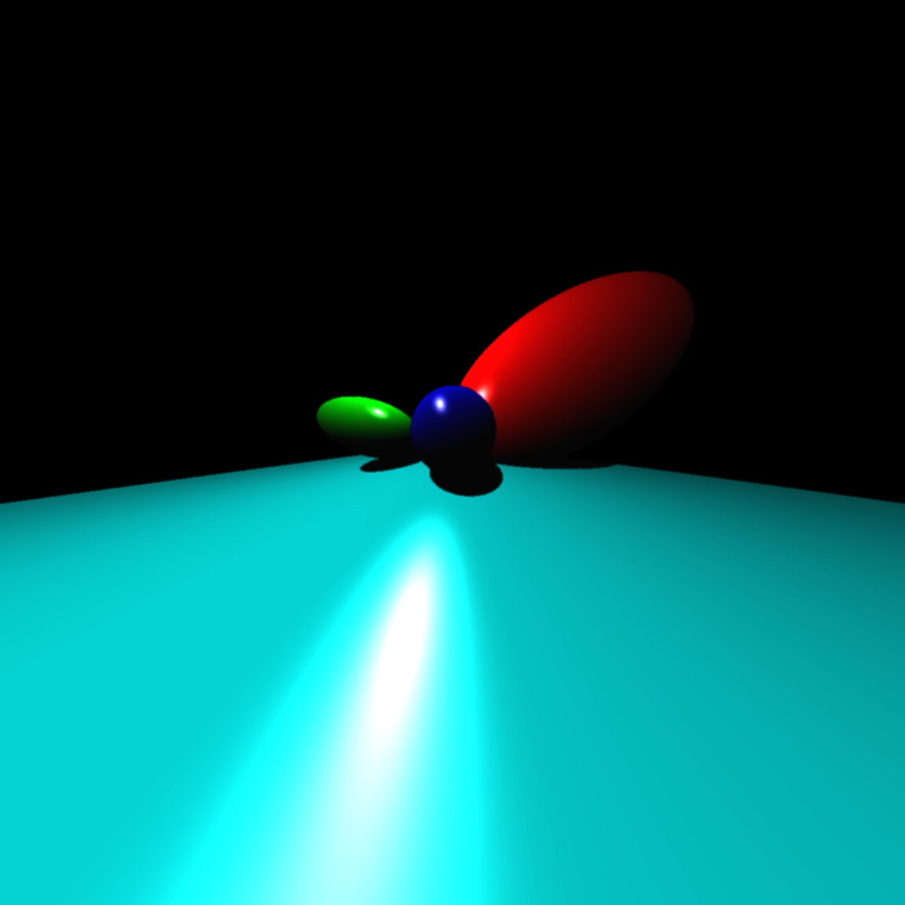
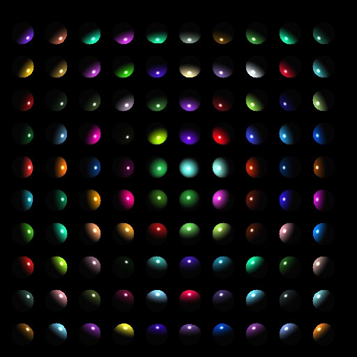

# ray-tracing
Ray Tracing Project for Computer Graphics. 

# What is so special about this ray tracer?
Aside from normal futures like different kinds of projection, I paralelized and added an antialiaser to my raytracer. Fairly simple and straightforward! 

But I still can't draw spheres and planes on paper.
